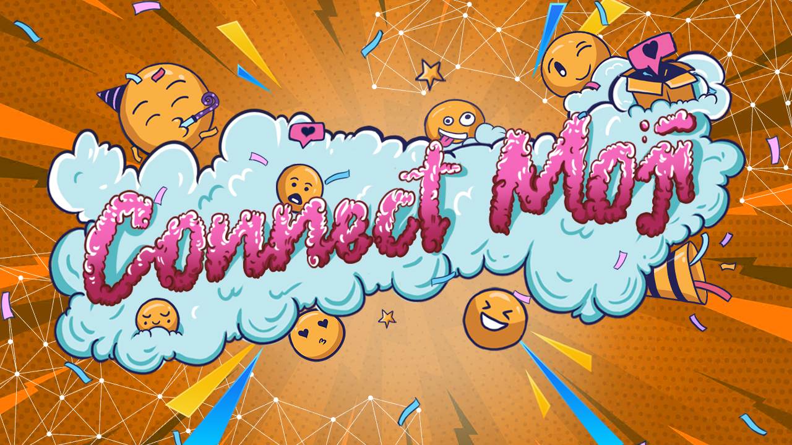

# connect-moji
 


> Event driven mobile control framework.

Connect-moji is a simple framework designed to supply information and control from one device to many clients at the same time without conflict. Data is provided on client requests only and without required constant connection to improve mobile preformance. 


## Getting started

Installing
```console
npm i https://github.com/SkullCrusher/connect-moji
```

## Understanding our use case
Historically our software was only a desktop application which means the user has to physcially be at the machine or use some form of remote desktop software to manage it. Connect moji 

## How it works

General points
- Flow of a request
  - The client asks connect moji to send a event and payload to the device and waits for a response.
  - Connect moji encrypts the event and payload and attempts to send the message to the server.
  - If there is a connection issue or no response is provided in a reasonable time a error is thrown.
  - If the server provides a response it is decrypted and client gets the response payload.
- Server
  - Requests that can't be decrypted are automatically rejected with a response.
  - Every event is handled through one function instead of independently binding a function for each event.
- Client
  - If an encryption key is bad the event handler for bad encryption is fired and the request times out. The server can't decrypt the message to determine the event id so it just gives back an generic message.
  - The encryption key can be swapped out without reconnecting to the server.

For our production environment we use connect-moji-middleware which manages message replication, authentication, and client management. We use the remote server connection option which has the server connect to the remote middleware. 


## Examples

Client
```javascript
const { Client } = require('connect-moji');

// Create a new client.
const na = new Client();

// Connect to the server.
na.connect("ws://localhost:8080", "debug_encryption_key").then(async ()=>{

    // Trigger a event and wait for the response.
    let result = await na.send("example-event", { "key": "example" })

    console.log("result", result)
});

```

Server
```javascript
const Server = require('connect-moji');

// Create a new server.
const na     = new Server();

// Handles determing how to process events.
function handleMessage(payload){
    return "result example"
}

// Host a listener.
na.host(handleMessage, "debug_encryption_key")
```

Runnable examples:
- [`Server Example`](https://github.com/SkullCrusher/connect-moji/blob/main/example-server.js) - Sample server
- [`Client Example`](https://github.com/SkullCrusher/connect-moji/blob/main/example-client.js) - Sample client


## Secruity
If a encryption key is provided all traffic is encrypted using AES. In a market where our customers often share account, both renting their account out and with friends, we decided to force the client to know the key (instead of public key encryption). The goal is to prevent access to personal information if a third party is able to gain account access to an account.

In production we force the user to scan a QR code generated by the server which contains the encryption key. It's a quick solution for users to gain access and users can send the qr code to anyone that they want.

> **Note:**
> 
> Public key could easily be added onto the framework or simply implimented on top of the framework using the events and updating the encryption key.

## Contribute
We welcome people to help us improve the framework or request features. Please create a issue for bugs and email us at hi@kickmoji.io for a feature request to talk to us directly.
