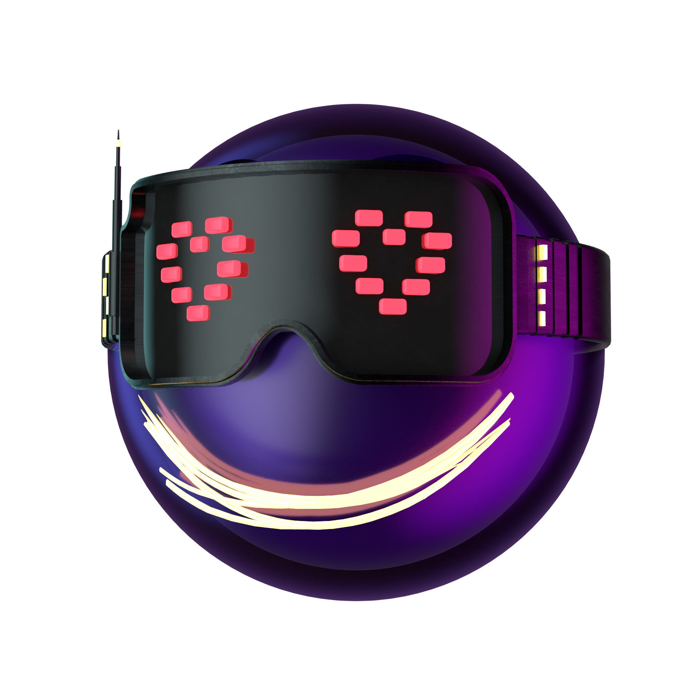

# connect-moji
 


> Event driven mobile control framework.

Connect-moji is a simple framework designed to supply information to any number of clients the same data based on event requests only. The design is to allow any number of clients to control the same device without conflict.


## Getting started
WIP

## Installing
```console
npm i https://github.com/SkullCrusher/connect-moji
```

## Examples

Client
```javascript
const { Client } = require('connect-moji');

// Create a new client.
const na = new Client();

// Connect to the server.
na.connect("ws://localhost:8080", "debug_encryption_key").then(async ()=>{

    // Trigger a event and wait for the response.
    let result = await na.send("example-event", { "key": "example" })

    console.log("result", result)
});

```

Server
```javascript
console.log("a");
```

Runnable examples:
- [`Server Example`](https://github.com/SkullCrusher/connect-moji/blob/main/example-server.js) - Sample server
- [`Client Example`](https://github.com/SkullCrusher/connect-moji/blob/main/example-client.js) - Sample client


## Secruity
If a encryption key is provided all traffic is encrypted using AES. Public private keys are not used to prevent


## Contribute
We welcome people to help us improve the framework or request features. Please create a issue for bugs and email us at hi@kickmoji.io for a feature request to talk to us directly.
